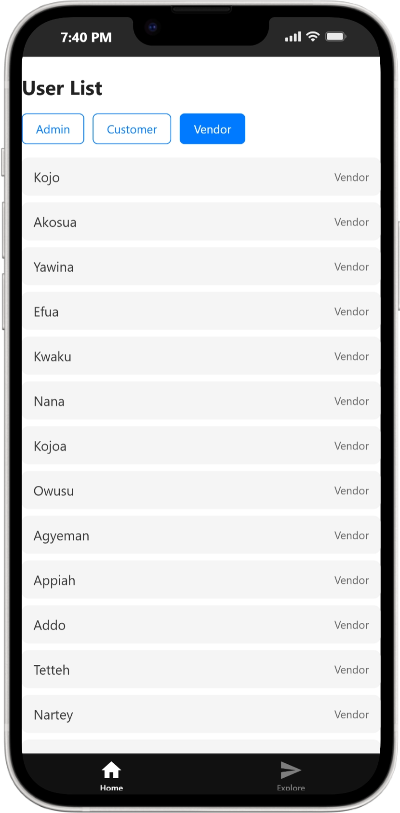
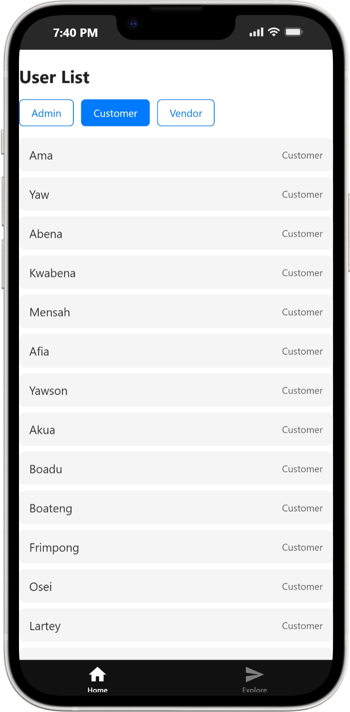

# UserListApp

A simple React Native mobile application built with Expo that displays a filterable list of users with different roles (Admin, Customer, Vendor).

## Features

- **User List Display** — View all users with their names and roles
- **Role-Based Filtering** — Filter users by Admin, Customer, or Vendor roles
- **Responsive UI** — Clean, simple interface built with React Native
- **Multi-Platform** — Runs on Android, iOS, and web

## Screenshots

<div align="center">
  <table>
    <tr>
      <td align="center" width="50%">
        <b>Customer Filter</b><br>
        
      </td>
      <td align="center" width="50%">
        <b>Vendor Filter</b><br>
        
      </td>
    </tr>
  </table>
</div>

## Tech Stack

- **Expo** — Cross-platform mobile development framework
- **React Native** — Native mobile app development
- **TypeScript** — Type-safe JavaScript
- **React Navigation** — App routing and navigation

## Project Structure

```
UserListApp/
├── app/                    # App screens and layout
│   ├── (tabs)/            # Tab-based navigation
│   │   ├── index.tsx      # Main user list screen
│   │   └── explore.tsx    # Explore screen
│   ├── _layout.tsx        # App layout configuration
│   └── modal.tsx          # Modal component
├── components/            # Reusable UI components
├── constants/             # App constants and theme
├── hooks/                 # Custom React hooks
├── dataset.json           # User data
├── package.json           # Dependencies
└── README.md             # This file
```

## Getting Started

### Prerequisites

- Node.js (v16 or higher)
- npm or yarn

### Installation

1. Navigate to the project directory:
   ```bash
   cd UserListApp
   ```

2. Install dependencies:
   ```bash
   npm install
   ```

### Running the App

Start the development server:
```bash
npm start
```

You'll see options to open the app in:
- **Android Emulator** — Press `a`
- **iOS Simulator** — Press `i`
- **Web Browser** — Press `w`
- **Expo Go App** — Scan QR code with your phone

## Available Scripts

- `npm start` — Start development server
- `npm run android` — Run on Android emulator
- `npm run ios` — Run on iOS simulator
- `npm run web` — Run in web browser
- `npm run lint` — Run ESLint
- `npm run reset-project` — Reset to blank project

## Data

User data is stored in `dataset.json` and includes 50 sample users with the following roles:
- **Admin** — Administrator users
- **Customer** — Customer users
- **Vendor** — Vendor users

## Usage

1. Launch the app
2. See the full user list displayed on the home screen
3. Use the filter buttons (Admin, Customer, Vendor) to narrow down results
4. Click the respective button again to deselect the filter

## Development

The app uses file-based routing via Expo Router. Edit files in the `app/` directory to modify screens and navigation.

### Key Files

- [app/(tabs)/index.tsx](UserListApp/app/(tabs)/index.tsx) — Main user list screen with filtering logic
- [dataset.json](UserListApp/dataset.json) — User dataset
- [constants/theme.ts](UserListApp/constants/theme.ts) — App theme and styling

## Notes

- No external API calls — all data is local
- No AI or machine learning components
- Simple, straightforward React Native implementation

## License

Private project for technical assessment.

## Support

For issues or questions, refer to the [Expo documentation](https://docs.expo.dev).
